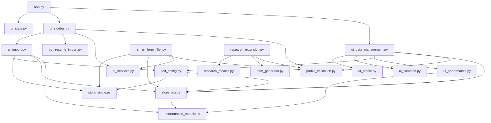

## 项目代码结构说明（当前版本）

本文件用于说明当前代码的**分层结构**、**各模块职责**、**模块间交互**，以及相比"之前把大量逻辑堆在 `app.py`"的版本**好在哪里**。

---

### 1) 目录与文件概览（核心文件）

```
vibecoding/
  app.py                      # Streamlit 主入口（轻薄：页面编排/路由，仅 ~60 行）
  smart_form_filler.py        # 智能填表功能（识别字段、生成答案、导出）
  research_extension.py       # 科研表单功能 UI（选择人员、生成表单、下载）
  research_models.py          # 科研档案数据模型与存储、预算校验、扁平化映射
  form_generator.py           # 模板填充引擎（Excel/Word；batch/aggregate）
  pdf_resume_import.py        # PDF 简历文本提取 + 清洗（必要时 OCR）

  store_single.py             # 个人版存储层（user_profile.json，兼容镜像）
  store_org.py                # 多人版存储层（OrgStore v3：groups/people/memberships/performance）
  self_config.py              # "我是谁"绑定层（个人版 ↔ 多人版身份关联）
  performance_models.py       # 🆕 绩效与贡献模型层（纯函数/数据结构/解析/计算）
  profile_validation.py       # "必填信息完整性"校验（通用/科研）
  ai_services.py              # DeepSeek/OpenAI SDK 兼容的 AI 服务封装（统一常量/Prompt）
  ui_profile.py               # 画像展示 UI 组件（展示/表格/完整性面板）
  ui_performance.py           # 🆕 绩效面板 UI 组件（指标/贡献/调整/历史/排行榜）
  ui_state.py                 # session_state 初始化（统一状态键）
  ui_sidebar.py               # 侧边栏（模式选择/API Key/导入/清除）
  ui_import.py                # 导入流程（CSV/Excel/PDF/文本）+ 绩效/贡献导入策略
  ui_data_management.py       # 数据管理页（个人版/多人版双视角 UI + 绩效面板）
  ui_common.py                # 通用 UI（空状态/导出按钮）

  user_profile.json           # 个人版数据（兼容镜像，主数据在 OrgStore）
  user_profiles_multi.json    # 多人版数据（OrgStore v3，唯一主数据源）
  self_config.json            # "我是谁"绑定配置（self_person_id）
  test_data/                  # 测试数据（CSV/Excel/TXT/PDF，含绩效/贡献列）
```

---

### 2) 分层设计（从"堆在一起"到"可维护"）

当前结构按职责拆成 5 层（从底到顶）：

- **Store（存储层）**：只负责读写/迁移/去重，不依赖 Streamlit
  - `store_single.py`：个人版 `user_profile.json`（兼容镜像）
  - `store_org.py`：多人版 `OrgStore v3`（组织/小组/人员/组内信息/绩效）
  - `self_config.py`："我是谁"绑定层（将个人版绑定到 OrgStore 中的某个 person）

- **Domain Models（领域模型层）**：纯函数，不依赖 Streamlit / 不做文件读写
  - `performance_models.py`：🆕 绩效与贡献的数据结构、计算、解析、过滤
  - `research_models.py`：科研档案数据模型

- **Service（服务层）**：封装外部能力（LLM），不直接操控 UI
  - `ai_services.py`：DeepSeek 调用、统一 `base_url/model/prompt`，统一返回 `(profile, raw_content, error)`

- **Validation（校验层）**：统一的"信息完整性规则"
  - `profile_validation.py`：通用/科研两套 schema
  - 目前已强化：**通用必填包含"电话必填"**（多人版以电话为主键做去重）

- **UI Components（可复用 UI 组件）**
  - `ui_profile.py`：`display_profile_from_text / display_profile_from_file / render_profile_completeness_panel`
  - `ui_performance.py`：🆕 绩效面板（概览指标/贡献管理/手动调整/基准分/事件历史/团队排行榜）
  - `ui_common.py`：空状态/导出按钮
  - `ui_data_management.py`：数据管理页面（个人/多人双视角 + 绩效面板嵌入）
  - `ui_import.py`：导入流程（文件/PDF/文本/绩效/贡献）
  - `ui_sidebar.py`：侧边栏组装
  - `ui_state.py`：session_state 统一初始化

- **Feature Modules（业务功能模块）**
  - `smart_form_filler.py`：智能填表（Excel/Word/Text）+ 生成/润色/导出（含完整性阻断）
  - `research_extension.py`：科研表单 UI（含完整性阻断）
  - `form_generator.py`：模板生成引擎
  - `pdf_resume_import.py`：PDF 简历提取与清洗

最上层由 **`app.py`** 负责把这些层"组装起来"，进行页面布局与交互编排。

---

### 3) 关键数据模型

#### 3.1 个人版与多人版的统一（🆕 重要变更）

**设计理念**：个人版用户 = 多人版中的"我自己"

- `self_config.json` 存储 `self_person_id`，指向 OrgStore 中的某个 person
- 个人版保存时会 **自动写入 OrgStore**（upsert，按电话去重）并绑定为"我"
- 个人版读取时从 OrgStore 读取该 person 的完整信息（含所有 memberships）
- `user_profile.json` 仅作为**兼容镜像**，不再是主数据源

```
┌─────────────────────────────────────────────────────────────┐
│                    user_profiles_multi.json                 │
│                     (OrgStore v2 - 主数据源)                 │
│  ┌─────────────────────────────────────────────────────┐   │
│  │ people: [                                            │   │
│  │   { id: "p1", name: "我", phone: "138...", ... },   │◀──┼── self_config.json
│  │   { id: "p2", name: "同事A", ... },                  │   │   { self_person_id: "p1" }
│  │   ...                                                │   │
│  │ ]                                                    │   │
│  └─────────────────────────────────────────────────────┘   │
└─────────────────────────────────────────────────────────────┘
                              ▲
                              │ 同步写入
                              │
                    ┌─────────┴─────────┐
                    │ user_profile.json │
                    │  (兼容镜像/导入源) │
                    └───────────────────┘
```

#### 3.2 多人版（OrgStore v3）

- 文件：`user_profiles_multi.json`
- 结构（简化）：

```json
{
  "_schema_version": 3,
  "org": { "id": "org_default", "name": "大团队", "created_at": "...", "updated_at": "..." },
  "groups": [
    { "id": "g1", "name": "项目A组", "description": "", "tags": [], "created_at": "...", "updated_at": "..." }
  ],
  "people": [
    {
      "id": "p1",
      "name": "张三",
      "phone": "138...",
      "email": "xx@yy.com",
      "dedup": { "strategy": "phone_then_email", "key": "phone:138..." },
      "profile": { "...": "..." },
      "memberships": [
        { "group_id": "g1", "joined_at": "...", "updated_at": "...", "fields": { "role": "组长" } }
      ],
      "performance": {
        "base_score": 85.0,
        "events": [
          { "id": "e_abc123", "type": "contribution", "delta": 20.0, "title": "主导XX项目上线", "note": "", "group_id": "g1", "at": "2025-06-01" },
          { "id": "e_def456", "type": "manual_adjust", "delta": -5.0, "title": "迟到扣分", "note": "", "group_id": null, "at": "2025-07-01" }
        ],
        "updated_at": "2025-07-01 10:00:00"
      }
    }
  ]
}
```

要点：
- **people 全局唯一**：同电话（优先）/邮箱（兜底）会合并为同一人
- **groups 可重叠**：同一个人可以在多个 `memberships` 中出现
- **组内信息 rich**：`membership.fields` 可随业务扩展（角色/任务/权限/评价等）
- **绩效模型**（v3 新增）：
  - `performance.base_score`：基准分（导入时设定，可手动修改）
  - `performance.events[]`：事件列表（`import_base` / `contribution` / `manual_adjust`）
  - `当前绩效 = base_score + sum(events[].delta)`
  - "主要贡献" = `type=contribution` 的事件
  - 事件可按 `group_id` 过滤（小组维度绩效视角）

---

### 4) 模块交互关系（谁调用谁）



核心约束在交互层面已经做了：
- `smart_form_filler.py` **不再 `import app`**（避免循环依赖/强耦合）
- 生成/导出按钮统一受 `profile_validation.py` 的结果影响（缺必填就阻断）
- 个人版保存 → `self_config.save_self_profile()` → OrgStore + 镜像

---

### 5) 相比之前版本，好在哪里（高收益点）

- **解耦**：存储（JSON/迁移/去重）、AI 调用、校验规则、UI 展示不再混在一起
- **一致性**：完整性规则统一在 `profile_validation.py`，不会出现"某处能导出、某处不能导出"的不一致
- **可扩展**：多人版的"组内信息"通过 `membership.fields` 扩展，不需要反复改数据结构
- **个人版 = 多人版中的"我"**：🆕 个人版数据自动同步到 OrgStore，未来可直接在多人版中看到自己的所有小组信息
- **可维护**：
  - 改必填字段 → 只改 `profile_validation.py`
  - 改去重策略 → 只改 `store_org.py`
  - 改模型/Prompt → 只改 `ai_services.py`
  - 改展示样式 → 只改 `ui_profile.py`
  - 改"我是谁"绑定逻辑 → 只改 `self_config.py`
  - 改绩效计算/事件结构 → 只改 `performance_models.py`
  - 改绩效 UI 面板 → 只改 `ui_performance.py`

---

### 6) 常见改动指南（你之后改功能会很快）

- **调整"个人必填字段"**：改 `profile_validation.py` 的 `validate_general_profile()` / `validate_research_profile()`
- **让多人版导入更严格（例如无电话直接拒绝入库）**：在 `ui_import.py` 的批量导入循环前/循环内做过滤，或在 `store_org.upsert_person()` 之前校验
- **智能填表新增一种输入格式**：在 `smart_form_filler.py` 里新增一个输入分支，然后沿用同一套 `validate_* -> generate -> export` 流程
- **科研表单支持新的占位符映射**：改 `research_models.flatten_profile_for_template()` 和 `form_generator.py` 的占位符替换逻辑
- **更改"我是谁"的绑定策略**：改 `self_config.py` 的 `bind_self_by_phone()` 或 `save_self_profile()`

---

### 7) 备注

当前已完成：
- ✅ `app.py` 瘦身（从 2000+ 行缩减到 ~60 行）
- ✅ 个人版与多人版数据统一（OrgStore 为主数据源）
- ✅ "我是谁"绑定层（`self_config.py`）
- ✅ 模块化拆分（UI/存储/校验/服务分离）
- ✅ OrgStore v3 Schema 迁移（自动为旧数据补齐 performance 字段）
- ✅ 绩效与贡献功能（`performance_models.py` + `ui_performance.py`）
  - 基准分设置/手动调整/主要贡献/事件历史
  - 团队绩效排行榜（柱状图 + 表格 + CSV 导出）
  - 导入支持绩效列/贡献列自动识别（`ui_import.py`）
  - 个人版/组织视角/小组视角三处均嵌入绩效面板
